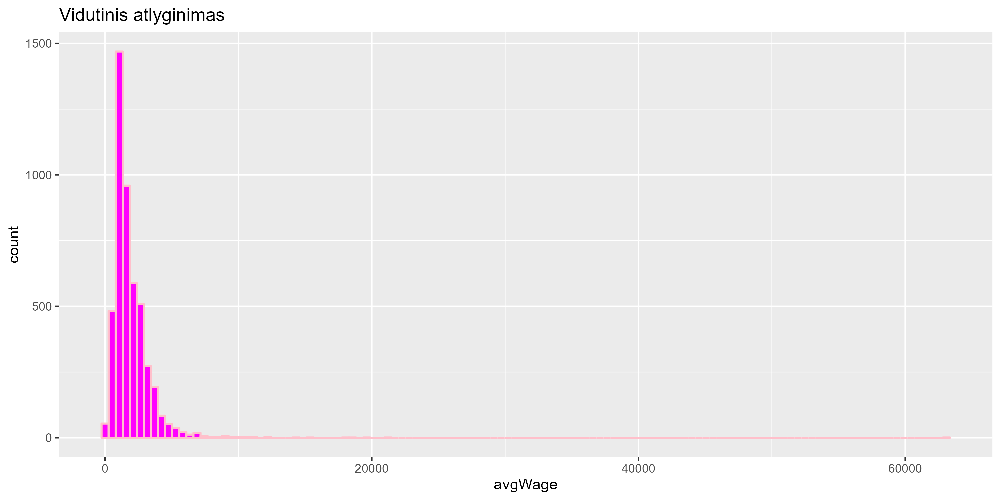

# R Laboratorinis darbas: duomenų vizualizacija

|Variantas | ecoActCode|Formatas          |
|:---------|----------:|:-----------------|
|13         |     522920|https://atvira.sodra.lt/imones/downloads/2023/monthly-2023.json.zip|

### 2.1 Užduotis

Atsakymas:

Išvados:

### 2.2 Užduotis

Atsakymas:

Išvados:

### 2.3 Užduotis

Atsakymas:

Išvados:

### 3. Užduotis

Shiny R aplikacijos nuotrauka:

